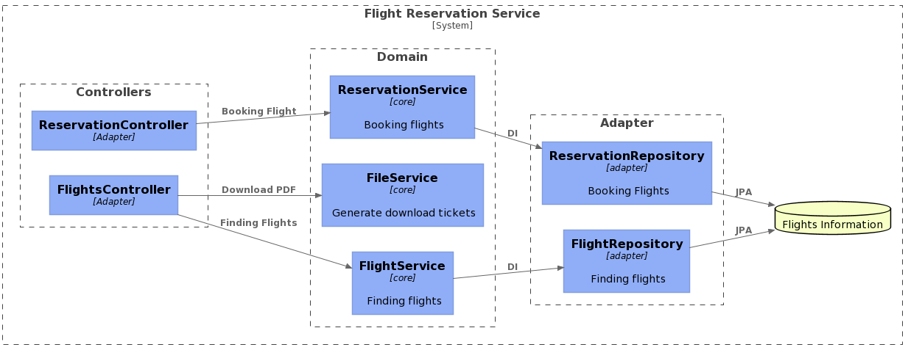

# Flight Reservation Service API
This **Flight Reservation Service API** has the following operations:
1. Find flights for given search parameters.
2. Allows users to book a flight with following Flight Reservation Request & Flight Reservation Response JSON
      ```json
               {
                   flightId: "12"
                   dateOfBirth: "1981-01-14"
                   email: "apsayamp@gmail.com"
                   expiryDate: "2024-01-29"
                   firstName: "Shiv"
                   lastName: "Sankar"
                   middleName: "Narayan"
                   phone: 81190890
                   cardHolderName: "apsaym"
                   cardNumber: "54354343555669999"
               }
   
              {
                       bookingConfirmationNumber: "200"
                    status : Confirmed
                    fileName : 200_Sayampu.pdf
                  
               }
   ```
3. Provides the Download PDF link to download the Flight Itinerary.

## C4 Daigram




## Technology/Tools/Approach:
- [ ] Framework - Spring Boot: 2.2.5
- [ ] REST API - Spring Web
- [ ] Testing Framework : Mockito, jUnit5, Integration Test cases 
- [ ] Im-memory Database - H2 Database
- [ ] ORM Framework: Spring Data JPA
- [ ] Intellij IDEA
- [ ] Java 8
- [ ] Test Driven Development
- [ ] Maven 3.8.3
- [ ] Lombok
- [ ] iText for PDF generation

## Assumptions:
1. List of flights imported into In-Memory database during Startup 
2. Flight Itinerary generated in PDF using following pattern **/SystemPath/<bookingConfirmNumber_lastname.pdf**

## Usage Guidance:
### Pre-requisites:
1. JDK 8
2. Maven 3.8.3
3. Lombok setup
4. Please update the system path in application.properties file for ```pdf.path``` to generate the PDF documents 

### Installation Steps:
1. Unzip the Jpmc_Test_Maruthi.zip file
  
2. ```cd``` into project location ```flight-reservation-service```.
   ```bash
      cd flight-reservation-service/
   ```
3. Execute ```maven``` install phase
   ```bash
      mvn clean install
   ```
   and you should be able to see that the application is built successfully.
   ```txt
		[INFO]
		[INFO] Results:
		[INFO]
		[INFO] Tests run: 17, Failures: 0, Errors: 0, Skipped: 0
		[INFO]
		[INFO]
		[INFO] --- maven-jar-plugin:3.1.2:jar (default-jar) @ flight-reservation-service ---
		[INFO] Building jar: C:\Users\Maruthi\Data\GitHub\flight-reservation-service\target\flight-reservation-service-0.0.1-SNAPSHOT.jar
		[INFO]
		[INFO] --- spring-boot-maven-plugin:2.2.5.RELEASE:repackage (repackage) @ flight-reservation-service ---
		[INFO] Replacing main artifact with repackaged archive
		[INFO]
		[INFO] --- maven-install-plugin:2.5.2:install (default-install) @ flight-reservation-service ---
		[INFO] Installing C:\Users\Maruthi\Data\GitHub\flight-reservation-service\target\flight-reservation-service-0.0.1-SNAPSHOT.jar to C:\Users\Maruthi\.m2\repository\c
		om\jpmc\flight\flight-reservation-service\0.0.1-SNAPSHOT\flight-reservation-service-0.0.1-SNAPSHOT.jar
		[INFO] Installing C:\Users\Maruthi\Data\GitHub\flight-reservation-service\pom.xml to C:\Users\Maruthi\.m2\repository\com\jpmc\flight\flight-reservation-service\0.0
		.1-SNAPSHOT\flight-reservation-service-0.0.1-SNAPSHOT.pom
		[INFO] ------------------------------------------------------------------------
		[INFO] BUILD SUCCESS
		[INFO] ------------------------------------------------------------------------
		[INFO] Total time:  35.818 s
		[INFO] Finished at: 2022-01-16T14:56:20+08:00
		[INFO] ------------------------------------------------------------------------

   ```
4. Now you are ready to start the ```flight-reservation-service``` application in your local machine.
   There are two ways to start the application:
	1. Spring Boot Plugin: Execute below maven command:
	   ```bash
		  mvn spring-boot:run
	   ```
	   You should be able to see the below logs, If the application has started successfully.
	   ```txt
			  PS C:\Users\Maruthi\Data\GitHub\flight-reservation-service> mvn spring-boot:run
				[INFO] Scanning for projects...
				[INFO]
				[INFO] -------------< com.jpmc.flight:flight-reservation-service >-------------
				[INFO] Building flight-reservation-service 0.0.1-SNAPSHOT
				[INFO] --------------------------------[ jar ]---------------------------------
				[INFO]
				[INFO] >>> spring-boot-maven-plugin:2.2.5.RELEASE:run (default-cli) > test-compile @ flight-reservation-service >>>
				[INFO]
				[INFO] --- jsonschema2pojo-maven-plugin:1.0.1:generate (default) @ flight-reservation-service ---
				[INFO]
				[INFO] --- maven-resources-plugin:3.1.0:resources (default-resources) @ flight-reservation-service ---
				[INFO] Using 'UTF-8' encoding to copy filtered resources.
				[INFO] Copying 1 resource
				[INFO] Copying 3 resources
				[INFO]
				[INFO] --- maven-compiler-plugin:3.8.1:compile (default-compile) @ flight-reservation-service ---
				[INFO] Changes detected - recompiling the module!
				[INFO] Compiling 32 source files to C:\Users\Maruthi\Data\GitHub\flight-reservation-service\target\classes
				[INFO]
				[INFO] --- maven-resources-plugin:3.1.0:testResources (default-testResources) @ flight-reservation-service ---
				[INFO] Using 'UTF-8' encoding to copy filtered resources.
				[INFO] skip non existing resourceDirectory C:\Users\Maruthi\Data\GitHub\flight-reservation-service\src\test\resources
				[INFO]
				[INFO] --- maven-compiler-plugin:3.8.1:testCompile (default-testCompile) @ flight-reservation-service ---
				[INFO] Changes detected - recompiling the module!
				[INFO] Compiling 9 source files to C:\Users\Maruthi\Data\GitHub\flight-reservation-service\target\test-classes
				[INFO]
				[INFO] <<< spring-boot-maven-plugin:2.2.5.RELEASE:run (default-cli) < test-compile @ flight-reservation-service <<<
				[INFO]
				[INFO]
				[INFO] --- spring-boot-maven-plugin:2.2.5.RELEASE:run (default-cli) @ flight-reservation-service ---
				[INFO] Attaching agents: []

				.   ____          _            __ _ _
				/\\ / ___'_ __ _ _(_)_ __  __ _ \ \ \ \
				( ( )\___ | '_ | '_| | '_ \/ _` | \ \ \ \
				\\/  ___)| |_)| | | | | || (_| |  ) ) ) )
				'  |____| .__|_| |_|_| |_\__, | / / / /
				=========|_|==============|___/=/_/_/_/
					:: Spring Boot ::        (v2.2.5.RELEASE)

				2022-01-16 15:05:47.728  INFO 10268 --- [  restartedMain] .j.t.FlightReservationServiceApplication : Starting FlightReservationServiceApplication on DESKTOP-M3AHD9
				N with PID 10268 (C:\Users\Maruthi\Data\GitHub\flight-reservation-service\target\classes started by Maruthi in C:\Users\Maruthi\Data\GitHub\flight-reservation-serv
				ice)
					2022-01-16 15:05:47.734  INFO 10268 --- [  restartedMain] .j.t.FlightReservationServiceApplication : No active profile set, falling back to default profiles: defau
				lt
				2022-01-16 15:05:47.820  INFO 10268 --- [  restartedMain] o.s.b.devtools.restart.ChangeableUrls    : The Class-Path manifest attribute in C:\Users\Maruthi\.m2\repo
				sitory\org\glassfish\jaxb\jaxb-runtime\2.3.2\jaxb-runtime-2.3.2.jar referenced one or more files that do not exist: file:/C:/Users/Maruthi/.m2/repository/org/glass
				fish/jaxb/jaxb-runtime/2.3.2/jakarta.xml.bind-api-2.3.2.jar,file:/C:/Users/Maruthi/.m2/repository/org/glassfish/jaxb/jaxb-runtime/2.3.2/txw2-2.3.2.jar,file:/C:/Use
				rs/Maruthi/.m2/repository/org/glassfish/jaxb/jaxb-runtime/2.3.2/istack-commons-runtime-3.0.8.jar,file:/C:/Users/Maruthi/.m2/repository/org/glassfish/jaxb/jaxb-runt
				ime/2.3.2/stax-ex-1.8.1.jar,file:/C:/Users/Maruthi/.m2/repository/org/glassfish/jaxb/jaxb-runtime/2.3.2/FastInfoset-1.2.16.jar,file:/C:/Users/Maruthi/.m2/repositor
				y/org/glassfish/jaxb/jaxb-runtime/2.3.2/jakarta.activation-api-1.2.1.jar
				2022-01-16 15:05:47.821  INFO 10268 --- [  restartedMain] .e.DevToolsPropertyDefaultsPostProcessor : Devtools property defaults active! Set 'spring.devtools.add-pr
				operties' to 'false' to disable
				2022-01-16 15:05:47.822  INFO 10268 --- [  restartedMain] .e.DevToolsPropertyDefaultsPostProcessor : For additional web related logging consider setting the 'loggi
				ng.level.web' property to 'DEBUG'
				2022-01-16 15:05:48.705  INFO 10268 --- [  restartedMain] .s.d.r.c.RepositoryConfigurationDelegate : Bootstrapping Spring Data JPA repositories in DEFAULT mode.
				2022-01-16 15:05:48.804  INFO 10268 --- [  restartedMain] .s.d.r.c.RepositoryConfigurationDelegate : Finished Spring Data repository scanning in 88ms. Found 2 JPA
				repository interfaces.
				2022-01-16 15:05:49.650  INFO 10268 --- [  restartedMain] o.s.b.w.embedded.tomcat.TomcatWebServer  : Tomcat initialized with port(s): 8082 (http)
				2022-01-16 15:05:49.662  INFO 10268 --- [  restartedMain] o.apache.catalina.core.StandardService   : Starting service [Tomcat]
				2022-01-16 15:05:49.663  INFO 10268 --- [  restartedMain] org.apache.catalina.core.StandardEngine  : Starting Servlet engine: [Apache Tomcat/9.0.31]
				2022-01-16 15:05:49.788  INFO 10268 --- [  restartedMain] o.a.c.c.C.[Tomcat].[localhost].[/]       : Initializing Spring embedded WebApplicationContext
				2022-01-16 15:05:49.788  INFO 10268 --- [  restartedMain] o.s.web.context.ContextLoader            : Root WebApplicationContext: initialization completed in 1966 m
				s
				2022-01-16 15:05:49.835  INFO 10268 --- [  restartedMain] com.zaxxer.hikari.HikariDataSource       : HikariPool-1 - Starting...
				2022-01-16 15:05:49.988  INFO 10268 --- [  restartedMain] com.zaxxer.hikari.HikariDataSource       : HikariPool-1 - Start completed.
				2022-01-16 15:05:49.994  INFO 10268 --- [  restartedMain] o.s.b.a.h2.H2ConsoleAutoConfiguration    : H2 console available at '/h2-console'. Database available at '
				jdbc:h2:mem:testdb'
				2022-01-16 15:05:50.131  INFO 10268 --- [  restartedMain] o.hibernate.jpa.internal.util.LogHelper  : HHH000204: Processing PersistenceUnitInfo [name: default]
				2022-01-16 15:05:50.196  INFO 10268 --- [  restartedMain] org.hibernate.Version                    : HHH000412: Hibernate ORM core version 5.4.12.Final
				2022-01-16 15:05:50.303  INFO 10268 --- [  restartedMain] o.hibernate.annotations.common.Version   : HCANN000001: Hibernate Commons Annotations {5.1.0.Final}
				2022-01-16 15:05:50.410  INFO 10268 --- [  restartedMain] org.hibernate.dialect.Dialect            : HHH000400: Using dialect: org.hibernate.dialect.H2Dialect
				2022-01-16 15:05:51.054  INFO 10268 --- [  restartedMain] o.h.e.t.j.p.i.JtaPlatformInitiator       : HHH000490: Using JtaPlatform implementation: [org.hibernate.en
				gine.transaction.jta.platform.internal.NoJtaPlatform]
				2022-01-16 15:05:51.061  INFO 10268 --- [  restartedMain] j.LocalContainerEntityManagerFactoryBean : Initialized JPA EntityManagerFactory for persistence unit 'def
				ault'
				2022-01-16 15:05:51.082  INFO 10268 --- [  restartedMain] o.s.b.d.a.OptionalLiveReloadServer       : LiveReload server is running on port 35729
				2022-01-16 15:05:51.534  WARN 10268 --- [  restartedMain] JpaBaseConfiguration$JpaWebConfiguration : spring.jpa.open-in-view is enabled by default. Therefore, data
				base queries may be performed during view rendering. Explicitly configure spring.jpa.open-in-view to disable this warning
				2022-01-16 15:05:51.624  INFO 10268 --- [  restartedMain] o.s.s.concurrent.ThreadPoolTaskExecutor  : Initializing ExecutorService 'applicationTaskExecutor'
				2022-01-16 15:05:52.424  INFO 10268 --- [  restartedMain] o.s.b.w.embedded.tomcat.TomcatWebServer  : Tomcat started on port(s): 8082 (http) with context path ''
				2022-01-16 15:05:52.428  INFO 10268 --- [  restartedMain] .j.t.FlightReservationServiceApplication : Started FlightReservationServiceApplication in 5.144 seconds (
			JVM running for 5.826)
	   ```
	2. After 3rd step, the jar [flight-reservation-service-0.0.1-SNAPSHOT.jar](target/flight-reservation-service-0.0.1-SNAPSHOT.jar) is built successfully into **target** folder, so execute the below command to start the application.
	   ```bash
		   java -jar target/flight-reservation-service-0.0.1-SNAPSHOT.jar
	   ```
	   
	   >Note: 8082 port being configured in application.properties. The application won't start, If port 8082 is not available in your machine. In that case, try to execute below command by passing port number as a vm argument:
	   > ``` java -Dserver.port=<port-number> -jar target/track-activity-service-0.0.1-SNAPSHOT.jar ```
	   > And this requires to change the port in Angular environment.ts file 
### Usage Guidance:
The above-mentioned APIs (Find flights, Book Flight, Download PDF) are accessble from browser using swagger-ui. Please hit the below url from the browser, the swagger-ui with all the exposed APIs are listed.
[Swagger UI for Activity Service API](http://localhost:8082/swagger-ui.html)

or hit the below by updating the port number provided in the above steps.
```http://localhost:<port-number>/swagger-ui.html``` if you have changed the port number. Please refer the following screenshot


#### Connect to H2 In-Mmeory database

1Connect to [H2 Database GUI] 
Please refer the following link. Port can be changed if not 8082. 

http://localhost:8082/h2-console/login.jsp

	```properties
	spring.datasource.url=jdbc:h2:mem:testdb
	spring.datasource.driverClassName=org.h2.Driver
	spring.datasource.username=sa
	# for production env, fetch password from the secret services while starting the application
	spring.datasource.password=
	```
>Note: this folder name and path can be configured from [application.properties](src/main/resources/application.properties)
If everything goes well, you will see like below:
`

## Improvements:

	1. can use API Key from UI to Flight Reservation Service API's ( like oAuth2, JWT Tokens ) 
	2. Spring Cloud Gateway to access the Services  


